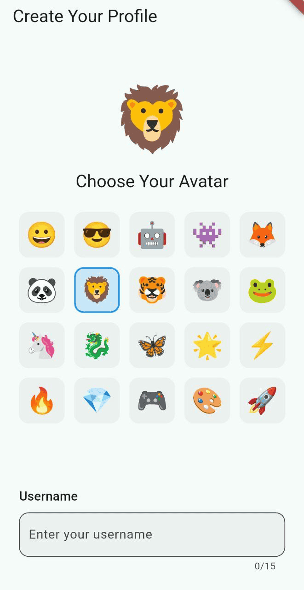
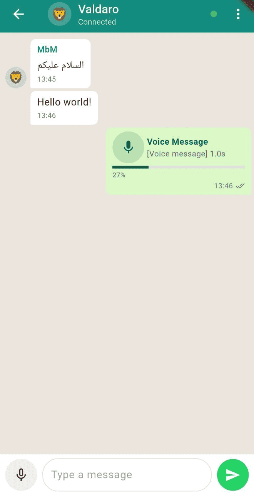

# 📡 LoRa Messenger - Offline Communication App

<div align="center">


**Talk to anyone, anywhere - no internet, no cell towers, no limits!** 🌍

[](https://flutter.dev)
[]()
[](LICENSE)

</div>

---

## 🚀 What is LoRa Messenger?

LoRa Messenger is a complete **offline messaging system** that combines a Flutter mobile app with LoRa radio technology to enable **long-range, infrastructure-free communication**. Chat with friends up to several kilometers away without WiFi, cellular networks, or internet!

### ✨ Key Features

#### 🎨 **Profile System with Avatars**
- **58 unique emoji avatars** to choose from (🦊🤖🏍️🐼🚀💎⚡🔥 and more!)
- **Persistent storage** - your profile is saved directly on the LoRa board's EEPROM
- **Auto-setup** - first-time users are guided through profile creation
- **Editable anytime** - change your username and avatar whenever you want


*Choose your avatar and create your profile*

#### 📡 **LoRa Radar - Discovery System**
- **Real-time discovery** of nearby LoRa devices
- **Visual radar display** showing all online users
- **Distance estimation** - see how far away each user is (5m, 50m, 500m, etc.)
- **Signal strength indicators** (Excellent, Good, Fair, Poor)
- **Avatar display** for all discovered devices


*Discover nearby users on the radar*

#### 💬 **WhatsApp-Style Chat Interface**
- **Beautiful chat bubbles** with sender avatars
- **Voice messaging** - hold to record, swipe to cancel
- **Real-time progress** for voice message transmission
- **Message timestamps** and read receipts
- **Avatar display** in chat header and message bubbles
- **Export conversations** to text files


*Clean, modern chat interface with avatars*

#### 🔊 **Voice Messaging**
- **Long-press to record** audio messages
- **Swipe left to cancel** recording
- **Compressed transmission** using GZIP for faster sending
- **Progress tracking** with smooth animations
- **Playback controls** for received voice messages


*Record and send voice messages*

#### 🌐 **Dual Connectivity**
- **Bluetooth Low Energy (BLE)** - wireless connection to your LoRa board
- **USB Serial (OTG)** - wired connection option
- **Automatic reconnection** and connection status indicators
- **Top notification banners** for connection status

---

## 🎯 Why Use LoRa Messenger?

| Traditional Apps | LoRa Messenger |
|-----------------|----------------|
| ❌ Requires cellular/WiFi | ✅ **No network needed** |
| ❌ Limited to coverage areas | ✅ **Works anywhere** (up to several km) |
| ❌ Requires internet infrastructure | ✅ **Peer-to-peer direct** |
| ❌ Privacy concerns | ✅ **Private LoRa network** |
| ❌ Fails during emergencies | ✅ **Always works** |
| ❌ Monthly fees | ✅ **Completely free** |

### 🌟 Perfect For:
- 🏕️ **Outdoor adventures** (hiking, camping, festivals)
- 🚨 **Emergency communication** (natural disasters, power outages)
- 🏔️ **Remote areas** (mountains, deserts, rural locations)
- 🔒 **Privacy-focused** communication
- 🎪 **Event coordination** (concerts, conventions, gatherings)
- 🌊 **Maritime communication** (sailing, boating)

---

## 📱 Screenshots

<div align="center">

| Profile Setup | Radar Discovery | Chat with Avatars | Voice Messages |
|--------------|----------------|-------------------|----------------|
|  |  |  |  |

</div>

---

## 🛠️ How It Works

```
┌─────────────┐                    ┌─────────────┐
│   Phone 1   │◄──── BLE/USB ────►│ LoRa Board 1│
│             │                    │             │
│  Flutter    │                    │  Heltec V3  │
│    App      │                    │   + EEPROM  │
└─────────────┘                    └──────┬──────┘
                                          │
                                    LoRa Radio
                                    (up to km)
                                          │
┌─────────────┐                    ┌──────┴──────┐
│   Phone 2   │◄──── BLE/USB ────►│ LoRa Board 2│
│             │                    │             │
│  Flutter    │                    │  Heltec V3  │
│    App      │                    │   + EEPROM  │
└─────────────┘                    └─────────────┘
```

1. **Connect** your phone to the LoRa board via Bluetooth or USB
2. **Create your profile** with username and avatar (stored on board)
3. **Discover users** on the radar screen
4. **Start chatting** - messages travel via LoRa radio waves!

---

## 🚀 Getting Started

### 📋 Prerequisites

**Hardware:**
- 📱 Android or iOS smartphone
- 📡 [Heltec Wireless Stick Lite V3](https://heltec.org/project/wireless-stick-lite-v3/) (or compatible LoRa board)
- 🔌 USB OTG cable (for USB mode) or Bluetooth (for wireless)

**Software:**
- 📦 [Flutter SDK](https://flutter.dev) (3.0.0 or higher)
- 🔧 [Arduino IDE](https://www.arduino.cc/en/software) (for flashing the board)
- 📚 [Heltec ESP32 Board Support](https://heltec.org/arduino-esp32/)

---

### 📥 Installation

#### 1️⃣ **Setup the LoRa Board**

```bash
# 1. Open Arduino IDE
# 2. Install Heltec ESP32 board support:
#    File → Preferences → Additional Board URLs:
#    https://github.com/Heltec-Aaron-Lee/WiFi_Kit_series/releases/download/x.x.x/package_heltec_esp32_index.json

# 3. Install required libraries:
#    Tools → Manage Libraries → Search and install:
#    - Heltec ESP32 Dev-Boards

# 4. Open HeltecV3_SerialBridge/HeltecV3_SerialBridge.ino
# 5. Select board: Tools → Board → Heltec WiFi Series → WiFi LoRa 32(V3)
# 6. Upload to your board!
```

#### 2️⃣ **Setup the Flutter App**

```bash
# Clone the repository
git clone https://github.com/yourusername/lora-messenger.git
cd lora-messenger

# Install dependencies
flutter pub get

# Run on your device
flutter run
```

---

## 📖 User Guide

### 🎨 First-Time Setup

**1. Connect to Your LoRa Board**


- Open the app → **Config** tab
- Tap **Bluetooth** or **USB** tab
- Select your **Heltec V3 LoRa Bridge**
- Tap **Connect**

**2. Create Your Profile**


- Profile setup appears **automatically** on first connection
- Choose one of **58 emoji avatars** 🦊🤖🏍️🐼🚀💎⚡🔥
- Enter your **username** (max 15 characters)
- Tap **Save** - profile is stored on the board!

**3. Discover Nearby Users**


- Navigate to **Radar** tab (automatically after setup)
- The radar **scans continuously** for nearby devices
- Each device shows:
  - 👤 **Avatar** and **username**
  - 📡 **Signal strength** (RSSI in dBm)
  - 📏 **Distance estimate** (~5m, ~50m, ~500m, etc.)
- Tap a device to **Chat** or **View Profile**

**4. Start Chatting**


- Select a user from radar → **Chat**
- Type messages or **hold mic button** for voice
- Messages appear with sender's **avatar**
- Voice messages show **progress bar** during transmission

---

### 🎙️ Voice Messaging Guide

| Action | How To |
|--------|--------|
| **Record** | Press and **hold** the 🎤 mic button |
| **Send** | **Release** the button (after holding for 0.5s) |
| **Cancel** | **Swipe left** while holding |
| **Play** | Tap the ▶️ play button on received voice message |



---

### 📏 Understanding Distance Estimates

The radar shows distance based on signal strength (RSSI):

| RSSI (dBm) | Distance | Signal Quality | Range |
|------------|----------|----------------|--------|
| **-30 to -40** | < 5m | 🟢 Excellent | Very close |
| **-40 to -55** | 5-15m | 🟢 Very Good | Close |
| **-55 to -70** | 15-50m | 🟡 Good | Nearby |
| **-70 to -85** | 50-150m | 🟠 Fair | Medium |
| **-85 to -100** | 150-500m | 🔴 Weak | Far |
| **-100 to -110** | 0.5-1km | 🔴 Very Weak | Very far |
| **< -110** | > 1km | ⚫ Extremely Weak | Maximum range |

⚠️ **Note:** Distances are approximate and vary based on:
- 🏔️ Terrain (open field vs. city)
- 🏢 Obstacles (buildings, trees, hills)
- 🌦️ Weather conditions
- 📡 Antenna orientation and height

---

## 🏗️ Project Structure

```
📦 lora-messenger/
├── 📱 lib/
│   ├── 🚀 main.dart                          # App entry point
│   ├── 📄 models/
│   │   ├── avatar.dart                       # Avatar model (20 emojis)
│   │   ├── user_profile.dart                 # User profile model
│   │   ├── chat_message.dart                 # Message model
│   │   └── lora_device.dart                  # Discovered device model
│   ├── 📱 screens/
│   │   ├── configuration_screen.dart         # BLE/USB connection
│   │   ├── radar_screen.dart                 # Device discovery radar
│   │   ├── messaging_screen.dart             # Chat interface
│   │   ├── profile_setup_screen.dart         # First-time profile setup
│   │   ├── editable_profile_screen.dart      # Profile editing
│   │   └── profile_screen.dart               # View other user profiles
│   ├── ⚙️ services/
│   │   ├── serial_communication_service.dart # BLE/USB communication
│   │   ├── profile_manager.dart              # Profile state management
│   │   ├── profile_service.dart              # Local profile storage
│   │   └── notification_service.dart         # Push notifications
│   └── 🔌 providers/
│       └── serial_service_provider.dart      # State provider
│
├── 📡 HeltecV3_SerialBridge/
│   └── HeltecV3_SerialBridge.ino            # Arduino LoRa+BLE bridge
│
├── 🖼️ images/                                # Screenshots & diagrams
├── 📄 README.md                              # This file
└── 📋 pubspec.yaml                           # Flutter dependencies
```

---

## 🔧 Arduino Code Features

The `HeltecV3_SerialBridge.ino` sketch provides:

### ✨ Core Features
- 📡 **LoRa transceiver** (433MHz, SF7, 125kHz BW)
- 📶 **Bluetooth BLE** server (Nordic UART service)
- 🔌 **USB Serial** bridge (115200 baud)
- 💾 **EEPROM storage** for user profiles
- 📻 **Beacon broadcasting** every 5 seconds
- 🎙️ **Audio segmentation** and reassembly
- 🔄 **Bidirectional** message relay

### 🎯 Commands
| Command | Description |
|---------|-------------|
| `GET_PROFILE` | Retrieve stored profile from EEPROM |
| `SAVE_PROFILE:username:avatarId` | Save profile to EEPROM |
| `SET_USERNAME:name` | Update username (legacy) |
| `LORA_SCAN` | Request device list |
| `AT+INFO` | Show system information |
| `AT+DIAG` | Show diagnostics |

### 📊 Message Formats
- **Text:** `username:message`
- **Audio:** `AUDIO_B64_GZIP:duration:base64data`
- **Beacon:** `LORA_BEACON:username:deviceId:avatarId`
- **Segment:** `AUDIO_SEG:id:index:total:duration:username:data`

---

## 📦 Dependencies

### Flutter Packages
```yaml
dependencies:
  flutter_blue_plus: ^1.14.0      # Bluetooth Low Energy
  usb_serial: ^0.5.0              # USB serial communication
  permission_handler: ^11.0.0     # Permissions
  shared_preferences: ^2.2.0      # Local storage
  flutter_sound: ^9.2.13          # Audio recording
  just_audio: ^0.9.34             # Audio playback
  archive: ^3.3.7                 # GZIP compression
  path_provider: ^2.0.15          # File paths
```

### Arduino Libraries
- **Heltec ESP32 Dev-Boards** (built-in LoRa support)
- **ESP32 BLE Arduino** (built-in)
- **EEPROM** (built-in)

---

## ⚙️ Configuration

### LoRa Parameters (Arduino)
```cpp
#define RF_FREQUENCY        433000000  // 433 MHz
#define TX_POWER            14         // Max power for V3
#define SPREADING_FACTOR    7          // SF7 (faster)
#define BANDWIDTH           0          // 125 kHz
#define CODING_RATE         1          // 4/5
```

⚠️ **All devices must use the same frequency, SF, and BW to communicate!**

### Audio Settings
```cpp
#define AUDIO_REDUNDANCY    1          // Retransmission count
#define AUDIO_SEGMENT_DELAY 600        // ms between segments
```

---

## 🐛 Troubleshooting

### 🔴 Profile Setup Screen Not Appearing
- ✅ Make sure the LoRa board has the latest Arduino code
- ✅ Check that EEPROM is initialized (should see "EEPROM: Initialized" in serial monitor)
- ✅ Try disconnecting and reconnecting

### 🔴 No Devices on Radar
- ✅ Ensure both devices have **profiles created**
- ✅ Check that both boards use **identical LoRa settings**
- ✅ Verify Bluetooth/USB connection is active
- ✅ Look for "Beacon: Broadcasting" in serial monitor
- ✅ Check signal strength - devices may be too far apart

### 🔴 Voice Messages Not Sending
- ✅ Hold the mic button for at least **0.5 seconds**
- ✅ Check Bluetooth/USB connection status
- ✅ Watch progress bar - transmission takes time
- ✅ Verify receiver is within LoRa range

### 🔴 Bluetooth Connection Issues
- ✅ Enable Bluetooth on phone
- ✅ Grant all requested permissions
- ✅ Make sure board is powered on
- ✅ Try refreshing the device list
- ✅ On iOS, go to Settings → Bluetooth and "Forget" device, then reconnect

### 🔴 Distance Shows "1"
- ✅ Upload the latest Arduino code (includes beacon with avatarId)
- ✅ Both devices need to have avatars set up
- ✅ Check serial monitor for beacon format: `LORA_BEACON:username:deviceId:avatarId`

---

## 📐 Technical Specifications

### Range & Performance
- **LoRa Range:** Up to **1-5 km** (open field), **500m-1km** (urban)
- **Text Messages:** < 1 second transmission time
- **Voice Messages:** ~10-30 seconds (depends on length)
- **Beacon Interval:** Every 5 seconds
- **Max Message Size:** 255 bytes per LoRa packet

### Profile Storage
- **Storage:** EEPROM (64 bytes allocated)
- **Username:** Max 15 characters
- **Avatar:** 1 byte (20 options)
- **Persistence:** Survives power off / reset

### Audio Compression
- **Format:** M4A/AAC → Base64 → GZIP
- **Segment Size:** 200 bytes per LoRa packet
- **Compression Ratio:** ~60-70% size reduction
- **Quality:** 16kHz, mono

---

## 🎨 Avatar Gallery

Choose from **58 unique avatars** across 8 categories:

### 😊 Faces & Expressions (8)
😀 😎 🤩 😈 🤠 🥷 👻 💀

### 🦊 Animals (10)
🦊 🐼 🦁 🐯 🐨 🐸 🦅 🦈 🐺 🦉

### 🦄 Fantasy & Creatures (6)
🤖 👾 🦄 🐉 🦋 👽

### ✨ Symbols & Elements (7)
🌟 ⚡ 🔥 💎 ⭐ 💥 ✨

### 🎮 Activities & Hobbies (8)
🎮 🎨 🎸 🎵 ⚽ 🏀 🎯 🏆

### 🚀 Vehicles & Travel (8)
🚀 🏍️ 🚁 ✈️ 🚗 🚲 ⛵ 🛸

### 🍕 Food & Drink (5)
🍕 🍔 🍩 🍦 ☕

### 🌙 Nature & Weather (6)
🌙 ☀️ 🌊 🌵 🍀 🌺

**All avatars are family-friendly and visually distinct for easy recognition!**

---

## 🤝 Contributing

Contributions are welcome! Here's how you can help:

1. 🍴 **Fork** the repository
2. 🔨 **Create** a feature branch (`git checkout -b feature/AmazingFeature`)
3. ✅ **Commit** your changes (`git commit -m 'Add some AmazingFeature'`)
4. 📤 **Push** to the branch (`git push origin feature/AmazingFeature`)
5. 🎉 **Open** a Pull Request

### Ideas for Contributions
- 📍 GPS location sharing
- 🗺️ Offline mapping integration
- 🔐 End-to-end encryption
- 📸 Image/photo sharing
- 👥 Group chat support
- 🌙 Dark mode theme
- 🌍 Multi-language support

---

## 📄 License

This project is licensed under the **MIT License** - see the [LICENSE](LICENSE) file for details.

```
MIT License

Copyright (c) 2025 LoRa Messenger

Permission is hereby granted, free of charge, to any person obtaining a copy
of this software and associated documentation files (the "Software"), to deal
in the Software without restriction, including without limitation the rights
to use, copy, modify, merge, publish, distribute, sublicense, and/or sell
copies of the Software, and to permit persons to whom the Software is
furnished to do so, subject to the following conditions:

The above copyright notice and this permission notice shall be included in all
copies or substantial portions of the Software.
```

---

## 🙏 Acknowledgments

- 🏗️ **Heltec Automation** - for excellent LoRa development boards
- 📦 **Flutter Team** - for the amazing Flutter framework
- 🎨 **Material Design** - for beautiful UI components
- 🌍 **Open Source Community** - for inspiration and support

---

## 📞 Support & Contact

- 🐛 **Issues:** [GitHub Issues](https://github.com/akhele/lora-messenger/issues)
- 💬 **Discussions:** [GitHub Discussions](https://github.com/akhele/lora-messenger/discussions)
- 📧 **Email:** contact@akhele.com
- 🌐 **Website:** https://www.akhele.com

---

## 🗺️ Roadmap

### ✅ Completed
- [x] Profile system with avatars
- [x] EEPROM storage
- [x] Radar discovery system
- [x] Distance estimation
- [x] Voice messaging
- [x] Bluetooth & USB support

### 🚧 In Progress
- [ ] Group chat support
- [ ] Message encryption
- [ ] GPS location sharing

### 📋 Planned
- [ ] Image/photo sharing
- [ ] Offline maps integration
- [ ] Emergency SOS feature
- [ ] Multi-hop mesh networking
- [ ] Desktop app (Windows, macOS, Linux)

---

<div align="center">

## ⭐ Star this repo if you find it useful!

Made with ❤️ and 📡 LoRa technology

**Happy Chatting! 🎉**

</div>
